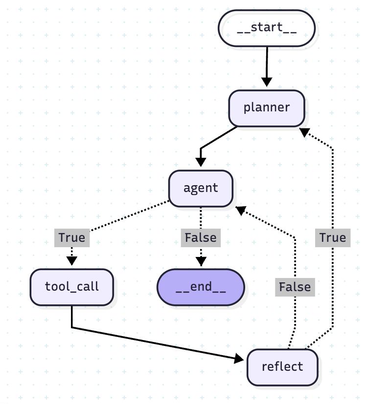
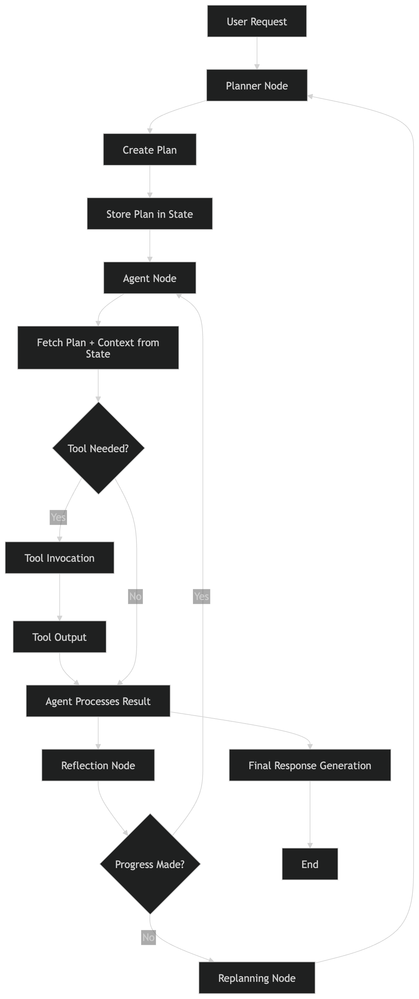
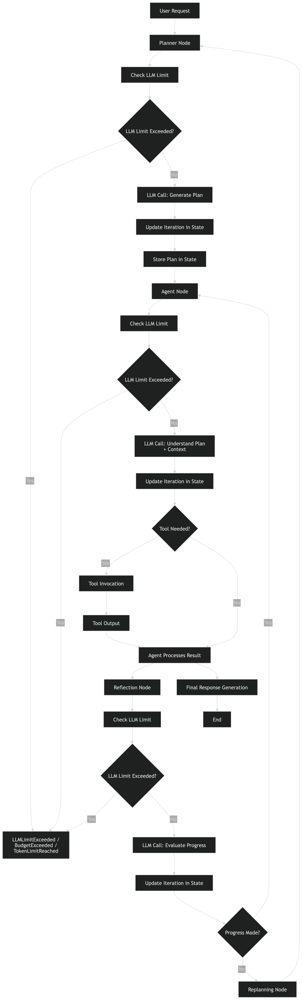

# Getting Started

## Prerequisites

- Python 3.13
- Docker & Docker Compose (for Qdrant and sandboxed code execution)

---

## 1. Clone & create virtual environment

```bash
git clone <repo-url>
cd resource-agent
python3.13 -m venv venv
source venv/bin/activate
```

## 2. Install dependencies

```bash
pip install -r requirements.txt
```

## 3. Configure environment

```bash
cp .env.example .env
```

Then open `.env` and fill in your keys:

### LLM Provider

| Variable | Default | Description |
|---|---|---|
| `LLM_PROVIDER` | `openai` | `openai`|
| `OPENAI_API_KEY` | — | **Required** when using OpenAI |
| `OPENAI_MODEL` | `gpt-4o-mini` | OpenAI chat model |
| `OPENAI_EMBED_MODEL` | `text-embedding-3-small` | OpenAI embedding model |
| `OPENAI_BASE_URL` | — | Optional: override for OpenAI-compatible endpoints |

### Tools & Services

| Variable | Default | Description |
|---|---|---|
| `TAVILY_API_KEY` | — | **Required** for web search |
| `QDRANT_HOST` | `localhost` | Qdrant vector DB host |
| `QDRANT_PORT` | `6333` | Qdrant port |
| `QDRANT_COLLECTION` | `knowledge_base` | Qdrant collection name |

### Agent Budget Controls

| Variable | Default | Description |
|---|---|---|
| `MAX_LLM_CALLS` | `10` | Max LLM calls per task |
| `MAX_COMPLETION_TOKENS` | `16384` | Total completion token budget across the session |
| `MAX_TOKEN_LIMIT` | `20000` | Total token cap (prompt + completion); `0` = disabled |
| `SUMMARY_TOKEN_BUFFER` | `100` | Tokens reserved for the progress-summary response |

## 4. Start supporting services

```bash
docker-compose up -d qdrant
```

> The knowledge base is ingested automatically on first startup — no manual step needed.

## 5. Run the agent (CLI)

```bash
# Basic usage
python -m app.main "your task here"

# Example
python -m app.main "analyze the recent stock price of nabil bank and generate a PDF"

# Resume a previous run
python -m app.main --resume <thread-id>

# Persist checkpoints across restarts (SQLite backend)
python -m app.main "your task" --backend sqlite
```

## 6. Run via Docker Compose (full stack)

```bash
docker-compose up --build
```

| Service | URL | Notes |
|---|---|---|
| **Agent API** | `http://localhost:8000/docs` | Interactive Swagger UI |
| **Qdrant dashboard** | `http://localhost:6333/dashboard` | Verify `knowledge_base` collection exists |

---

### API Endpoints

#### `GET /health`
Returns `{"status": "ok"}` when the service is up.

---

#### `POST /run` — Run the agent

**Request body**

```json
{
  "task": "What is the current weather today?",
  "thread_id": "my-thread-1",
  "backend": "memory",
  "max_iterations": 10
}
```

| Field | Type | Default | Description |
|---|---|---|---|
| `task` | `string` | — | **Required.** The task for the agent to execute |
| `thread_id` | `string` | auto | Reuse to resume a previous run |
| `backend` | `string` | `memory` | `memory` or `sqlite` |
| `max_iterations` | `integer` | `10` | Max LLM calls — lower this to test budget enforcement |

**Response**

```json
{
  "thread_id": "my-thread-1",
  "answer": "The final answer from the agent...",
  "stopped_reason": null,
  "completed_steps": ["step 1 result", "step 2 result"],
  "trace_path": "/app/traces/trace_20250607_120000.json",
  "downloadable_path": "/app/tmp/sandbox_output_1749276543.pdf",
  "cost": {
    "llm_calls": 4,
    "prompt_tokens": 1200,
    "completion_tokens": 340,
    "total_tokens": 1540,
    "estimated_cost_usd": 0.000231
  }
}
```

> `downloadable_path` is `null` when no file was generated. Pass it to `/download` to retrieve the file.

---

#### `GET /download?path=<path>` — Download a generated file

Pass the `downloadable_path` or `trace_path` from the `/run` response:

```
GET /download?path=/app/tmp/sandbox_output_1749276543.pdf
GET /download?path=/app/traces/trace_20250607_120000.json
```

Only paths inside `/app/tmp` and `/app/traces` are allowed.

Note: If you want to see the full log of executing the agent you can see on the agent container log.


---

# Architecture Overview

The system uses a **custom ReAct agent built with LangGraph**, providing full control over LLM interactions through three core nodes:
- **Planner**
- **Agent**
- **Reflect**

## Roles of Core Nodes
- The **Planner** generates an execution plan based on the user's query and the available tools.
- The **Agent** decides and executes the required actions.
- The **Reflect** node verifies whether the generated response aligns with the user's intent, triggering replanning if necessary.

## Resource Control
To control resource usage, the architecture implements an **LLM call budget** by tracking the number of LLM invocations in the agent state. If the predefined limit is reached, the system stops further LLM calls and instead produces a summarized response.
resource:


## Token Management
For token management, the system maintains a **maximum token budget** by tracking token consumption after each LLM interaction. It calculates the remaining available tokens and passes this value as the `max_completion_tokens` parameter in subsequent OpenAI API calls. This ensures that the model never generates output exceeding the allocated token limit.

## Timeout
for Timeout I have implemented the decorator as each tool has different timeout some tools may take more time some take less time so we can set the different time out time for different tools 

resource:




# Planning Loop:
I chose the **Hybrid ReAct planning loop (Planning + ReAct + Reflection)** because it enables the agent to plan before taking any action. The **Planning** phase analyzes the user's request against the available tools and generates an execution strategy. If the request cannot be satisfied with the available tools, the system can terminate early from the planning stage without unnecessary execution, saving both time and resources.

During execution, the **ReAct** component reasons and selects the appropriate actions, while the **Reflection** component continuously evaluates whether the agent's progress and intermediate responses remain aligned with the user's objective. If the agent deviates from the intended goal or the plan proves ineffective, the reflection step triggers **replanning** and the agent continues with an improved strategy. This combination of planning, reasoning, and self-correction makes the Hybrid ReAct approach more reliable, efficient, and robust than a pure ReAct loop.

In a multi-step loop like **plan → act → reflect → replan**, small errors can slowly build up.(Compounding Loop Instability (Drift Over Time))
- A slightly wrong plan → leads to slightly wrong actions  
- Reflection may incorrectly approve those actions  
- Replanning then continues based on the same incorrect path  


# Schema Design:
The agent uses a **global `AgentState` schema**, which is shared across all nodes in the LangGraph workflow. Each node can both **read** from and **update** the state, allowing information to persist throughout the execution lifecycle and enabling coordination between the Planner, Agent, and Reflection nodes.


### `AgentState` Fields


| Field | Purpose |
| --- | --- |
| **`messages`** | Stores the conversation history, including user messages, agent responses, and tool outputs. This provides the context required for subsequent LLM calls. |
| **`iteration`** | Tracks the total number of LLM calls made during execution. It is used to enforce the maximum LLM call budget and prevent excessive iterations. |
| **`plan`** | Stores the execution plan generated by the Planner node. This plan guides the Agent while performing the task. |
| **`completed_steps`** | Maintains a record of the steps that have been successfully completed during execution. It allows the Reflection node to evaluate overall progress. |
| **`making_progress`** | Indicates whether the agent is making meaningful progress toward the user's objective. The Reflection node updates this value after each execution step, and a value of `False` triggers replanning. |
| **`reflection_feedback`** | Stores feedback generated by the Reflection node, explaining why the current execution is not progressing as expected. This feedback is passed to the Planner to generate an improved plan. |
| **`token_limit_reached`** | A flag that indicates whether the allocated token budget has been exhausted. When set to `True`, the system prevents further token generation and handles the response accordingly. |

By maintaining a shared global state, the architecture enables seamless communication between nodes, supports replanning when necessary, and enforces both LLM call limits and token budget constraints.

# Prompt Strategy

I designed the system using a **tool-aware, role-separated prompt architecture** combined with explicit control mechanisms for planning, execution, progress tracking, tool usage, and budget management. The goal is to ensure reliable multi-step reasoning, correct tool usage, and controlled generation.

---

# 1. Role-Based Prompt Separation

The system is structured around three core roles:

- **System Role (Rules & Control Layer):** Defines execution rules, assigns dynamic roles (Planner, Executor, Progress Tracker), and enforces tool usage and output formatting.
- **User Role (Intent Layer):** Contains the user’s request, objectives, and constraints; treated as the source of truth.
- **Assistant Role (State Layer):** Maintains execution state, including tool outputs, intermediate results, and workflow history for continuity.

---

# 2. Structured Context Separation

To maintain clarity between different execution phases, I use explicit structured tags:
<plan>
  Step-by-step plan generated by the planner
</plan>

<steps_completed>
  Executed steps and results so far
</steps_completed>

<result>
  Final or intermediate output
</result>


## 3. Tool Awareness Strategy

The system is explicitly designed as a **tool-aware LLM agent**.

---

### Core Principles

Every tool is defined with:
- **Name**
- **Purpose**
- **Input / Output expectations**
- **Usage constraints**
when llm is bind with the tools llm will get the tool name, description, input schema.
---

### LLM Instructions

The model is instructed to:

- Use tools whenever required  
- Never hallucinate tool outputs  
- Always rely on tool responses for factual results  
- Validate tool outputs before proceeding  

---

## 4. Progress Checking Mechanism

After every step, the system performs a **structured progress evaluation**.

---

### How it works

The model compares:

- Original plan  
- Completed steps  
- Latest generated output  

---

Then it evaluates whether the execution is aligned with the user’s intent.

# 5. Budget Awareness Strategy

The system enforces strict **token and cost control** during LLM execution.

- `max_completion_tokens` is set in every API call to limit response length  
- This prevents unnecessary or overly verbose outputs  
- Encourages concise, high-signal responses focused only on the task  
- Helps control API usage cost and computational budget  

> The model is always constrained to generate within the defined token budget, ensuring predictable and efficient output generation.

## 6. Core Agent Prompt Strategy

The core agent is prompted with explicit rules across four areas to ensure reliable, safe, and efficient execution:

- **Tool Usage Rules**
- **Loop Control**
- **Safety & Injection Handling**
- **Hard Constraints**

# failures mode:
One failure mode observed is that when generating a PDF inside the sandbox, the agent occasionally produces code that fails at runtime. Each retry to correct the code consumes an additional LLM call, and if the errors persist, the agent exhausts the 10-call limit before completing the task.

# Future Work:
A known limitation of the current implementation is memory handling. The system does not reliably retain context across multiple interactions, meaning it may not consistently remember what was asked in earlier or later questions.

To address this, I plan to integrate a checkpointer so the system can persist and recall previous user queries along with their corresponding results, improving continuity and coherence across sessions. I will also work on **state management** to optimize how context is passed to the LLM. By structuring and maintaining state more efficiently, we can reduce unnecessary context size, which will in turn lower token usage and reduce overall cost while maintaining relevant information for reasoning.